# React 101, The Main React Workshop

This README contains the notes for the entire main React workshop, **where we make a basic Twitter clone from scratch**. It is split up into five parts:

1. Hello World with React and Create React App
2. Creating Your First Component
3. Hooks and State in React
4. Common React Patterns: Lists, Forms, and Conditional Rendering
5. Using GitHub and Netlify to Deploy Your App For Free

You don't need to be an HTML/CSS/JS pro to do this workshop, but a passing familarity is recommended. If you don't have Node.js on your computer though, **we do need that** - head to "[Setting up Node.js and a quick project tour](https://github.com/malsf21/qwerhacks-21-workshops/tree/main/react/node-setup-and-tour)" for more info there.

For every section beyond the first one, we'll also have a corresponding **checkpoint** that has all the code you need to do that section. If you fall behind or are confused, peep the checkpoints!

Note: **this workshop does not cover styling in-depth**. The focus is to create a working **interactive web-app**, but not necessarily the *prettiest* one. Beauty is in the eye of the beholder, after all!

## Table of Contents

* [Hello World with React and Create React App](#hello-world-with-react-and-create-react-app)
  * [Setting Everything Up](#setting-everything-up)
  * [Hello World](#hello-world)
* [Creating Your First Component](#creating-your-first-component)
* [Hooks and State in React](#hooks-and-state-in-react)
* [Common React Patterns: Lists, Forms, and Conditional Rendering](#common-react-patterns-lists-forms-and-conditional-rendering)
  * [Lists](#lists)
  * [Forms (and passing down functions)](#forms-and-passing-down-functions)
  * [Conditional Rendering](#conditional-rendering)
* [Using GitHub and Netlify to Deploy Your App For Free](#using-github-and-netlify-to-deploy-your-app-for-free)
  * [GitHub](#github)
  * [Netlify](#netlify)
* [Conclusion](#conclusion)
* [Licensing, Attribution, and Resources](#licensing-attribution-and-resources)

## Hello World with React and Create React App

In this workshop, **I assume you've already installed Node.js on your computer**. If you have not, **please do the "[Setting up Node.js and a quick project tour](https://github.com/malsf21/qwerhacks-21-workshops/tree/main/react/node-setup-and-tour)" workshop first**.

### Setting Everything Up

Today, we'll be using React to create a (meh-looking) Twitter clone, which is a good example of a frontend application. We're also going to use a library called [Create React App](https://github.com/facebook/create-react-app), which makes developing React apps *really* easy.

Okay, let's get started! First, we need to do some project setup; open up your terminal application (Powershell on Windows, Terminal on OSX; if you're using Linux, you should know already), and run:

```sh
$ npx create-react-app qwer-hacks
...
$ cd qwer-hacks
$ npm start
```

What did we just do?

* `npx create-react-app` is a command that creates a template application from [Create React App](https://github.com/facebook/create-react-app), which is a project boilerplate commonly used for React apps. It creates a folder (in this case, `qwer-hacks`), and installs a bunch of stuff in it!
* `cd` is the terminal command that changes the folder you're in; here, we're entering the `qwer-hacks` folder that we just made.
* `npm start` tells Node to "start" our project. More info in "[Setting up Node.js and a quick project tour](https://github.com/malsf21/qwerhacks-21-workshops/tree/main/react/node-setup-and-tour)"

After running `npm start`, you should get a message like this:

```sh
$ npm start
Compiled successfully!

You can now view qwer-hacks in the browser.

  Local:            http://localhost:3000/
  On Your Network:  http://x.x.x.x:3000/

Note that the development build is not optimized.
To create a production build, use yarn build.
```

Usually, it'll open your browser to your app; if it doesn't, visit whatever address follows "Local" in your browser (it's usually [http://localhost:3000/](http://localhost:3000/)).

You should get a screen like this:

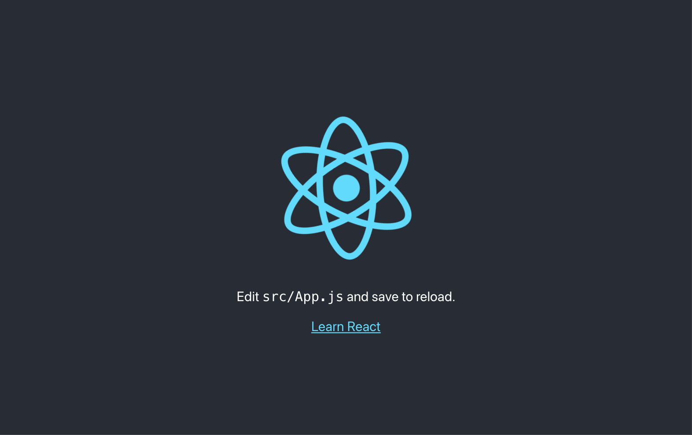

And we're ready. Let's get started!

### Hello World

As is customary, let's write a hello world message! The splash tells us to edit `src/App.js`, so let's do that!

```jsx
// src/App.js
import logo from './logo.svg';
import './App.css';

function App() {
  return (
    <div className="App">
      <header className="App-header">
        
        <p>
          Hello QWER Hacks!
        </p>
      </header>
    </div>
  );
}

export default App;
```

One convenient thing is that `create-react-app` automatically refreshes your page every time you make a change to your app's code; it just makes life *that* much easier. So, if we head to our new page:


In due time, we'll get to explaining every part of this file! But for now, let's take it step-by-step.

For now, let's establish that `App()` - which is a function - is also a *component*. This word has a special meaning in React, which we'll explore in a bit! What's important for now is that all components return something called **JSX**, which is what this function is returning.

Whatever gets returned by a *component* is what gets displayed on the page; our `App` component controls our entire site!

If you're familiar with HTML, this looks ... almost exactly like it! In fact, JSX is like HTML, but on superpowers. Almost all HTML is valid JSX; the only exceptions are:

* instead of `class`, you must use `className` - this is because `class` is a keyword in JavaScript
* the `style` tag works a little differently - we'll cover this in a moment
* a component must return just one JSX element! not two or more!

However, JSX has quite a few superpowers. The most relevant for us is the `{}`, which let us run JavaScript inside our code! Here are some examples:

```jsx
// src/App.js
function App() {
  return (
    <div className="App">
      <header className="App-header">
        
        <p>
          Hello QWER Hacks!
        </p>
        <p>
          Nine plus ten is {9 + 10}.
        </p>
        <p>
          A random number between 0 and 1: {Math.random()}
        </p>
        <p>
          The best hackathon is {"qwer hacks".toUpperCase()}
        </p>
      </header>
    </div>
  );
}
```

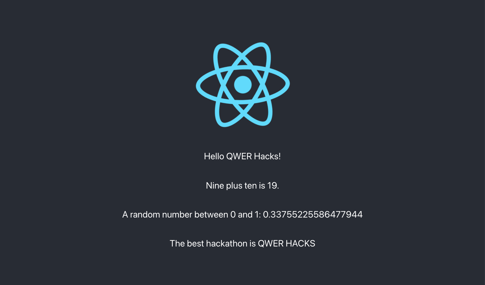

Sharp observers might notice that we also used the braces in the image tag, with `src={logo}`. What's going on there?

```jsx
// src/App.js
import logo from './logo.svg';
import './App.css';

function App() {
  return (
    <div className="App">
      <header className="App-header">
        
...
```

Well, `logo` is a global variable; we've imported it from `logo.svg`, which is a file in our project folder. We'll use this syntax again later (and explain it, so no worries), but you should be thinking: there are some JSX superpowers at play here!

Similar to global variables, you can also use local variables; we will be doing a lot of this in this project!

```jsx
// src/App.js
function App() {
  let coolestHackathon = "QWER Hacks!";
  return (
    <div className="App">
      <header className="App-header">
        
        <p>
          {coolestHackathon}
        </p>
      </header>
    </div>
  );
}
```


And that's it for the barebones basics! Let's do a quick recap of what we've covered:

* functions in React can represent **components**
* components return **JSX**, which is mostly like HTML
* in JSX, using `{}` lets you evaluate JavaScript

If you haven't copied the code for this section, don't worry about it! We'll start fresh in the next section.

## Creating Your First Component

One of the immediate strengths of React is that you can create your own components, and use them to simplify your project. In designing our Twitter clone, we'll want to think about it in the lens of components.

Let's start simple: the "unit" of our Twitter clone is a Tweet. So, let's start by creating a Tweet component, in a new file (`src/components/Tweet.js`):

```jsx
// src/components/Tweet.js

function Tweet() {
  const tweetStyle = {
    border: "1px solid white",
    padding: "1em",
    marginTop: "1em"
  }
  return (
    <div style={tweetStyle}>
      This is a Tweet!
    </div>
  );
}

export default Tweet;
```

We've created a super simple component that returns a `<div>`. We've also styled our component using the `style` prop. Of course, you can use external CSS too (peep `App.css`)!

However, styles in React work *a little differently*, in that properties are camel-cased instead of dash-cased (e.g. `paddingTop` instead of `padding-top`), and styles are a set of key-value pairs in an object. We're not going to do that much styling, so don't stress too much about CSS!

Note that we've also added this `export default` business - what does that mean?When we export a module (in this case, our component), we let other files import it. And who'd want to import our Tweet? Probably our `App` component!

Head back to `src/App.js`; cutting out some of the fluff from the previous section, adjust it to

```jsx
// src/App.js
import Tweet from './components/Tweet';
import './App.css';

function App() {
  return (
    <div className="App">
      <header className="App-header">
        <p>
          Hello QWER Hacks!
        </p>
        <Tweet />
      </header>
    </div>
  );
}

export default App;
```

Notice that we've imported the `Tweet` component from our `src/components/Tweet.js` file (leaving off the `.js` is fine), and we've used it like an HTML tag with `<Tweet />`.

And you'll see, our Tweet has been rendered to the screen!


Hm, that's not so useful though, is it! But, it turns out that we can create **custom properties** for our component, or `props`.

For our first iteration, let's say we need to know just two things for a Tweet:

1. the `@` of the author - let's call this `author`
2. the actual Tweet body - let's call this `body`

Now, adjust your `App.js` to have:

```jsx
...
<Tweet author="matt" body="QWER Hacks is awesome!" />
```

And ... nothing happened. That's because we need to tell our `Tweet` component what to do with these properties!

Head back to our `Tweet` component. Given that functions and components seem somewhat interchangeable, it'd be natural to assume that the **properties** passed to the component are like **arguments** for a function. And you would be correct to assume that!

```jsx
// src/components/Tweet.js

function Tweet(props) {
  const tweetStyle = { ... };
  return (
    <div style={tweetStyle}>
      {props.author} says: {props.body}
    </div>
  );
}
...
```

In React, custom components are passed all of their properties in one object; *we've chosen* to call it `props` (out of custom), but you can name it whatever you want. And, as you can see, we're *accessing* two parts of `props`: the `author`, and the `body`, and rendering them.

Okay, and does it work?

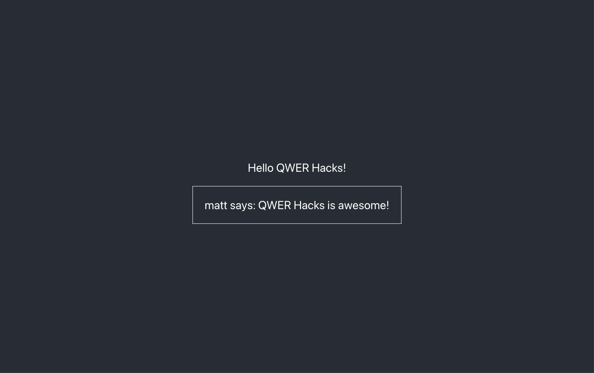

Wow, nice! We've made our very first, simple component. As a quick recap, we covered:

* creating your own component
* styling a component with inline `style`
* importing and using a component
* accessing the properties of a component

**Checkpoint #1**: [check out the code](./01-checkpoint).

## Hooks and State in React

Note: *this will continue from the previous section. Not sure what code you should have? Check out [checkpoint #1](./01-checkpoint)*

Okay, so we've got a wireframe going - but it's not interactive yet. Luckily, creating interactivity in your app is what React is really good at!

For a toy example, let's create a like/upvote button for our Tweet. Heading to `src/components/Tweet.js`, let's first create a simple button:

```jsx
// src/components/Tweet.js

function Tweet(props) {
  const tweetStyle = { ... };
  return (
    <div style={tweetStyle}>
      <p>
        {props.author} says: {props.body}
      </p>
      <p>
        number of likes: 42
      </p>
      <button>+1!</button>
    </div>
  );
}

export default Tweet;
```

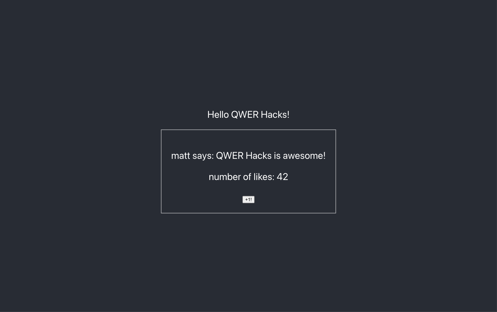

Maybe not the most accurate-looking Twitter clone, but it fulfills the spirit. Before we actually write our code, let's think about what we want to happen here:

* there should probably be a variable, maybe `likes`, that keeps track of how many likes our tweet has
* when we click the +1 button, we should update this variable
* and importantly, **every time the variable is updated, the component should be rerendered**

That last tidbit is one of the trickiest parts of web development. React elegantly solves this problem with something called **state**. Using **state** (and the "state **hook**"), we'll tell React which variables impact the rendering of our app; React will keep track of changes to the variable, and update it when needed. How convenient!

Let's take our Hook for a spin. First, we need to import the `useState` hook:

```jsx
// src/components/Tweet.js

import { useState } from 'react';

function Tweet(props) {
  const tweetStyle = { ... };
  return (
    <div style={tweetStyle}>
      <p>
        {props.author} says: {props.body}
      </p>
      <p>
        number of likes: 42
      </p>
      <button>+1!</button>
    </div>
  );
}

export default Tweet;
```

Don't forget the braces! If you're curious, this is [object destructuring](https://developer.mozilla.org/en-US/docs/Web/JavaScript/Reference/Operators/Destructuring_assignment#Object_destructuring), but it's not too important to understand the syntax.

Now, we're going to use it:

```jsx
// src/components/Tweet.js

import { useState } from 'react';

function Tweet(props) {
  const tweetStyle = { ... };
  const [likes, setLikes] = useState(0);
  return (
    <div style={tweetStyle}>
      <p>
        {props.author} says: {props.body}
      </p>
      <p>
        number of likes: 42
      </p>
      <button>+1!</button>
    </div>
  );
}

export default Tweet;
```

Hm, what's going on in this line? First, let's note that we're calling `useState`: it's a function! The argument that we're passing in is the *default* value for that state variable. I think `0` is a good default for a number of likes.

What does `useState` return, and what is that syntax there? This is called [array destructuring](https://developer.mozilla.org/en-US/docs/Web/JavaScript/Reference/Operators/Destructuring_assignment), and we're basically saying:

* `useState` returns an array
* for the first item in the array it returns, assign the name `likes` to it. `likes` will be the **current value of the state variable**.
* for the second item, assign the name `setLikes` to it. `setLikes` is a **function we use to update the state variable**.

Technically, you can name these variables whatever you want (this is the benefit of destructuring), but we'll name it this way out of convention.

Okay, so let's use these now and sketch out what we wanted.

```jsx
// src/components/Tweet.js

function Tweet(props) {
  const tweetStyle = { ... };
  const [likes, setLikes] = useState(0);
  const addLike = () => setLikes(likes + 1);
  return (
    <div style={tweetStyle}>
      <p>
        {props.author} says: {props.body}
      </p>
      <p>
        number of likes: {likes}
      </p>
      <button>+1!</button>
    </div>
  );
}
```

Here, `addLike` is an *arrow function* that calls `setLikes` with an incremented value; nothing too spicy. But when do we actually call `addLike`?

In typical HTML, `<button>` has a property called `onclick` that lets you pass a function to call. In React, there is a *very similar* property called `onClick` that does the same thing. So, let's just pass it `addLike`!

```jsx
// src/components/Tweet.js

function Tweet(props) {
  const tweetStyle = { ... };
  const [likes, setLikes] = useState(0);
  const addLike = () => setLikes(likes + 1);
  return (
    <div style={tweetStyle}>
      <p>
        {props.author} says: {props.body}
      </p>
      <p>
        number of likes: {likes}
      </p>
      <button onClick={addLike}>+1!</button>
    </div>
  );
}
```

Note that we didn't pass in `addLike()` - that would be *calling the function*, not *passing the function itself*. This is a tricky but important distinction.

And voila! Things are working! Notice that *every time* we click the button, the number goes up without fail. Nice!

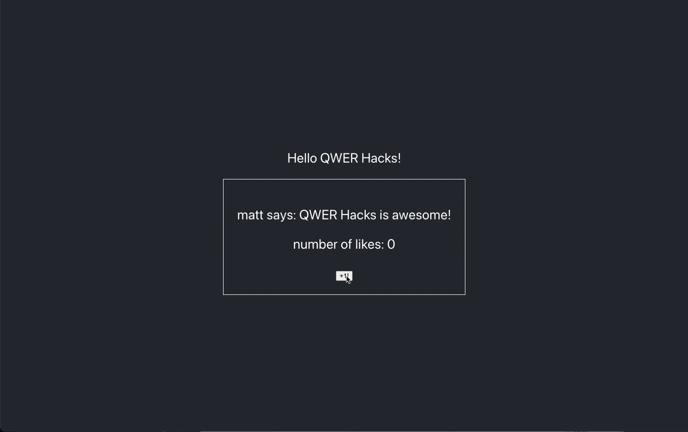

You might think that this is a bit confusing to update one button, and that'd be correct! But, we'll find that React makes building complex apps much easier; something we'll explore in the next section!

As a quick recap, here's what we covered:

* what the `useState` function's arguments and return values are
* how to use the return values from `useState`
* combining the `useState` hook with `onClick`

Lost on the code? Check out the checkpoint:

**Checkpoint 2:** [check out the code](./02-checkpoint)

## Common React Patterns: Lists, Forms, and Conditional Rendering

Note: *this will continue from the previous section. Not sure what code you should have? Check out [checkpoint #2](./02-checkpoint)*

Now that we understand components, state, and props (the very basic building blocks of React), we can start to flesh out the rest of our sample app! We'll use this as an excuse to explore some common React patterns that you might have to implement yourself in a webapp.

### Lists

First, note that we've only created one `Tweet` component; Twitter would be boring with just one Tweet! A naive approach might involve writing out a bunch of `Tweet` components, but that seems inefficient. Luckily, with the way we've written our app (with React), creating multiple Tweets is very easy: since they're all self-contained components, we can just render them from a list.

First, let's create some sample data. We'll add this to `App.js`; feel free to copy-paste this if you'd like:

```jsx
// src/App.js
import Tweet from './components/Tweet';
import './App.css';

const tweets = [
  {
    author: "matt",
    body: "QWER Hacks is awesome!",
  },
  {
    author: "sharvani",
    body: "arjun is the coolest bean of all time :heart:",
  },
  {
    author: "arjun",
    body: "no u <3",
  },
];

function App() {
  return (
    <div className="App">
      <header className="App-header">
        <p>
          Hello QWER Hacks!
        </p>
        <Tweet author="matt" body="QWER Hacks is awesome!">
      </header>
    </div>
  );
}
```

Now, we're going to make use of JavaScript's `Array.map()` function. If you're not familiar with it, here's how it works:

* you use it on a list
* you pass in a function that you want to call on every *element* of the list
* `Array.map()` returns a list (of the same size), with the function called on every element of the list

In our case, we want to transform our list into a list of components. Here's how we'd do it:

```jsx
// src/App.js
...
const tweets = [
  {
    author: "matt",
    body: "QWER Hacks is awesome!",
  },
  {
    author: "sharvani",
    body: "arjun is the coolest bean of all time :heart:",
  },
  {
    author: "arjun",
    body: "no u <3",
  },
];

function App() {
  return (
    <div className="App">
      <header className="App-header">
        <p>
          Hello QWER Hacks!
        </p>
        {
          tweets.map((tweet) => {
            return <Tweet author={tweet.author} body={tweet.body} />
          })
        }
      </header>
    </div>
  );
}
```

If you're unfamiliar with the syntax, we're passing in an arrow function to `.map()`; it takes in one parameter - `tweet`, or an element of `tweets` - and then returns an associated `Tweet`.

Great! And if we take a look ...

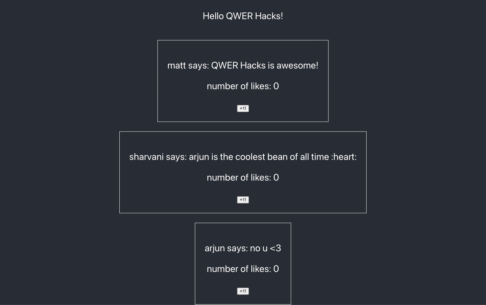

Importantly, note that incrementing the likes for one Tweet does not increment the likes for the other Tweet. This separation of logic (or self-contained component) is a really neat feature of React!

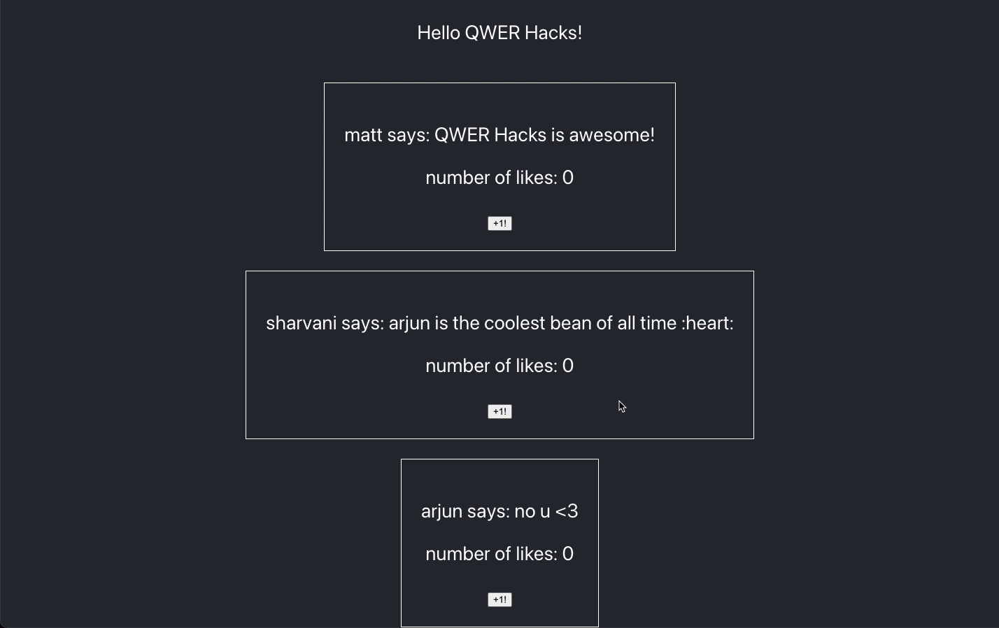

Awesome! Using `.map()` to generate lists of components is a **very common** pattern in React, so now you're just a little bit better at React :)

As a quick recap, we covered:

* creating a list to represent our data
* using `Array.map()` to create a list of components to render

**Checkpoint 3:** [check out the code](./03-checkpoint)

### Forms (and passing down functions)

Note: *this will continue from the previous section. Not sure what code you should have? Check out [checkpoint #3](./03-checkpoint)*

Now, I think we're ready to be able to write our own Tweets. Conceptually, we need to add some input box; then, when the user submits a Tweet, we should append it to our `tweets` list.

First, let's do some refactoring. Now that `tweets` is no longer constant (and depends on our app's actions), it should become **part of the app's state**. Luckily for us, `useState` works just as well with lists as it does for typical variables.

```jsx
// src/App.js
import { useState } from 'react';
import Tweet from './components/Tweet';
import './App.css';

const defaultTweets = [
  {
    author: "matt",
    body: "QWER Hacks is awesome!",
  },
  {
    author: "sharvani",
    body: "arjun is the coolest bean of all time :heart:",
  },
  {
    author: "arjun",
    body: "no u <3",
  },
];

function App() {
  const [tweets, setTweets] = useState(defaultTweets);
  return (
    <div className="App">
      <header className="App-header">
        <p>
          Hello QWER Hacks!
        </p>
        {
          tweets.map((tweet) => {
            return <Tweet author={tweet.author} body={tweet.body} />
          })
        }
      </header>
    </div>
  );
}

export default App;
```

Great! Now, to add our text box. This is separate enough that it warrants its own component; let's call it `src/components/ComposeTweet.js`, and create the basics of what we need:

```jsx
// src/components/ComposeTweet.js
function ComposeTweet() {
  return (
    <div>
      <p>write your own tweet</p>
      <input type="text" />
      <button>create</button>
    </div>
  )
}

export default ComposeTweet;
```

In React, we (almost) always want our state to be the "single source of truth". With that in mind, two questions:

* should we control the input with state?
* if so, which component should handle it?

Making decisions like this is a very important part of React! In my (semi-professional) opinion, we *should* control the input with state (this pattern is called a *controlled form input*). The actual changing text of the input doesn't concern `App`, so we can keep it in `ComposeTweet`; but, `App` should handle adding the new Tweet.

Great! Let's then write the code in `App` to handle that first.

```jsx
// src/App.js
import { useState } from 'react';
import ComposeTweet from './components/ComposeTweet';
import Tweet from './components/Tweet';
import './App.css';

const defaultTweets = [...];

function App() {
  const [tweets, setTweets] = useState(defaultTweets);
  const createTweet = (newTweetText) => {
    const newTweets = [...tweets];
    newTweets.push({
      author: "you!",
      body: newTweetText,
    });
    setTweets(newTweets);
  }
  return (
    <div className="App">
      <header className="App-header">
        <p>
          Hello QWER Hacks!
        </p>
        <ComposeTweet />
        {
          tweets.map((tweet) => {
            return <Tweet author={tweet.author} body={tweet.body} />
          })
        }
      </header>
    </div>
  );
}
```

Wow, that's a bunch of changes! To quickly walk you through what we've done:

* we created a new state variable `currentText`, and an accompanying setter. A good default is `""`!
* we wrote a new function called `createTweet`. It does a few things:
  1. create a variable called `newTweets`, which *copies* `tweets`, but adds a new tweet, with our `newTweetText`.
  2. updates our tweet list with our new tweet!

We're *almost* done! Let's move on to `ComposeTweet`. But, a question: how do we get `ComposeTweet` to call functions like `createTweet`? Well, one neat feature of JavaScript is that it is a *functional language*: this means that functions are just like other types of data, and in particular, that we can **pass functions as arguments to other functions**. We've actually already done this with the `onClick` listener, but it's worth repeating too.

With that in mind, let's pass our relevant functions to `ComposeTweet`:

```jsx
// src/App.js
...

const defaultTweets = [...];

function App() {
  const [tweets, setTweets] = useState(defaultTweets);
  const createTweet = (newTweetText) => {
    const newTweets = [...tweets];
    newTweets.push({
      author: "you!",
      body: newTweetText,
    });
    setTweets(newTweets);
  }
  return (
    <div className="App">
      <header className="App-header">
        <p>
          Hello QWER Hacks!
        </p>
        <ComposeTweet createTweet={createTweet} />
        {
          tweets.map((tweet) => {
            return <Tweet author={tweet.author} body={tweet.body} />
          })
        }
      </header>
    </div>
  );
}
```

Just as a check-in, your app should now look like this:

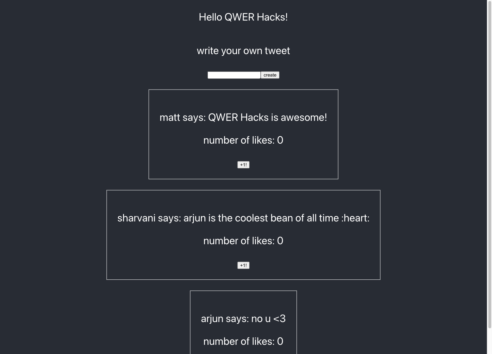

Great! Now, we can hop in to `ComposeTweet` to make use of this function, and to control our input.

```jsx
// src/components/ComposeTweet.js
import {useState} from 'react';

function ComposeTweet(props) {
  const [text, setText] = useState("");
  const handleInput = (e) => {
    setText(e.target.value);
  }
  const composeTweet = () => {
    props.createTweet(text);
    setText("");
  }
  return (
    <div>
      <p>write your own tweet</p>
      <input type="text" onChange={handleInput} value={text} />
      <button onClick={composeTweet}>create</button>
    </div>
  )
}

export default ComposeTweet;
```

Ooh! A few more changes. A step-by-step:

* we created a new state variable, `text`, to handle the input.
* similar to `button`, `input` has a field called `onChange` that fires every time the input box changes. In this case, we need to get what the new `value` of the input box is; we can accomplish this with `e.target.value` (where `e` is the fired event).
* we also set the `value` of the input box to be the `text`, so the `input` updates accordingly.
* we wrote a function called `composeTweet` that gets called when we hit create; it calls `App`'s `createTweet` with the content of the text box, then resets it.

Let's take a look:

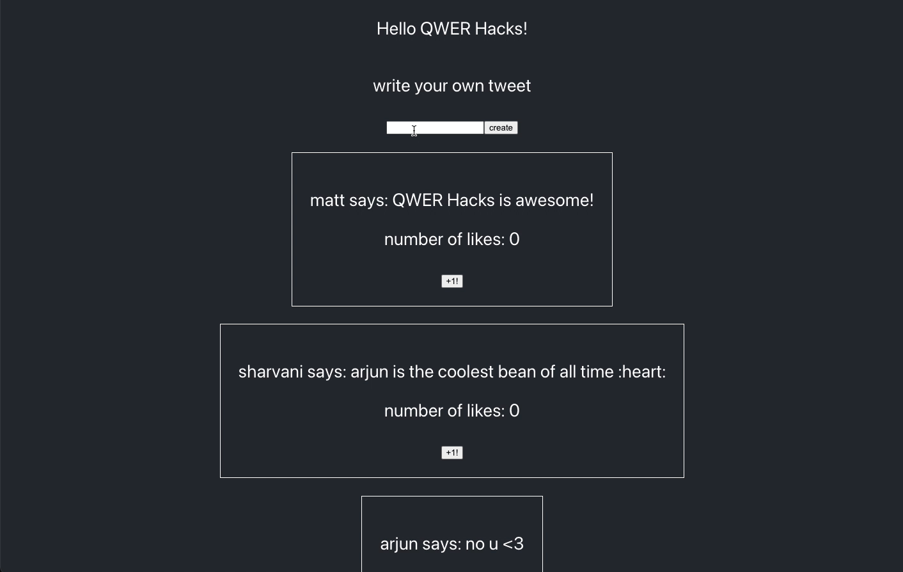

Awesome! That wasn't too hard after all. And note that, out of the box, the likes functionality all works as expected!

This process of *controlling* form inputs with state, and passing down state functions to other components, is another *extremely* common part of React. It's not limited to text inputs either; the same principle works with checkboxes, radios, and any custom input component you can think of!

As a quick recap, we covered:

* controlling a form input with state, `value`, and `onChange`
* passing a function down to a component
* updating an array with state

**Checkpoint 4:** [check out the code](./04-checkpoint)

### Conditional Rendering

Note: *this will continue from the previous section. Not sure what code you should have? Check out [checkpoint #4](./04-checkpoint)*

To complete our clone (and to give me an excuse to cover conditional rendering), let's also allow us to add our own name. However, before we add our name, we shouldn't let the user write Tweets!

Okay, so let's first make a standard `UserCreation` component; it'll be almost exactly the same as our `ComposeTweet` component (see the aside at the end if you're curious):

```jsx
// src/components/UserCreation.js
import {useState} from 'react';

function UserCreation(props) {
  const [text, setText] = useState("");
  const handleInput = (e) => {
    setText(e.target.value);
  }
  const createUser = () => {
    props.createUser(text);
    setText("");
  }
  return (
    <div>
      <p>introduce yourself</p>
      <input type="text" onChange={handleInput} value={text} />
      <button onClick={createUser}>create</button>
    </div>
  )
}

export default UserCreation;
```

Switching gears to `App`, we can first write out the logic of what our functions need to do:

```jsx
// src/App.js

...

function App() {
  const [tweets, setTweets] = useState(defaultTweets);
  const [username, setUsername] = useState("");

  const createTweet = (newTweetText) => {
    const newTweets = [...tweets];
    newTweets.push({
      author: username,
      body: newTweetText,
    });
    setTweets(newTweets);
  }

  const createUser = (newUsername) => {
    setUsername(newUsername);
  }
  ...
}
```

Pretty simple! Now, we need to import `UserCreation`, and display it only when the user hasn't set their username yet. To do that, we'll use JavaScript's ternary operator, `?`:

```jsx
// src/App.js

import ComposeTweet from './components/ComposeTweet';
import Tweet from './components/Tweet';
import UserCreation from './components/UserCreation';
import './App.css';

const defaultTweets = [...];

function App() {
  const [tweets, setTweets] = useState(defaultTweets);
  const [username, setUsername] = useState("");

  const createTweet = (newTweetText) => {
    const newTweets = [...tweets];
    newTweets.push({
      author: username,
      body: newTweetText,
    });
    setTweets(newTweets);
  }

  const createUser = (newUsername) => {
    setUsername(newUsername);
  }

  return (
    <div className="App">
      <header className="App-header">
        <p>
          Hello QWER Hacks!
        </p>
        {
          username === "" ?
            <UserCreation createUser={createUser} /> :
            <ComposeTweet createTweet={createTweet} />
        }
        {
          tweets.map((tweet) => {
            return <Tweet author={tweet.author} body={tweet.body} />
          })
        }
      </header>
    </div>
  );
}
```

A big code example, but we only did two things:

* we imported `UserCreation`
* we used the ternary operator. What it means is
  1. if `username === ""` (i.e. is the empty string), then return `<UserCreation ...>`
  2. else, return `<ComposeTweet ... />`

In other words, we toggle which component we show, depending on whether or not the user has set their username!

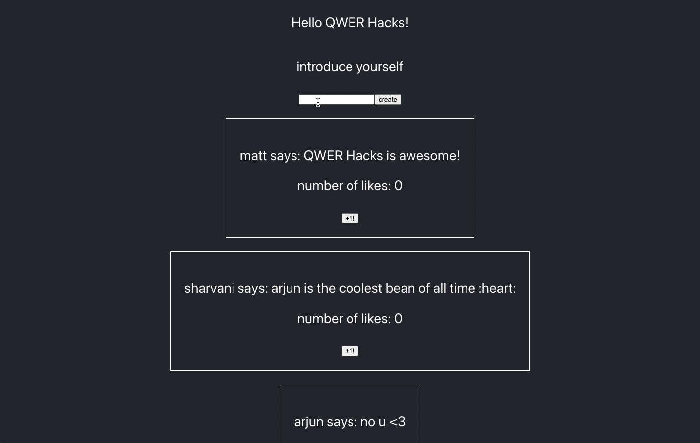

This pattern of *conditional rendering* is another super useful kit in your JavaScript toolbox. You'll use something like this every time you want to toggle the visibility of a component with JavaScript.

As a quick note, if you don't want to render *anything* if the condition is false, you can instead use the short-circuiting property of `&&`:

```jsx
// this only renders <SomeComponent /> if someVar is true
{someVar && <SomeComponent />}
```

We can use this to easily render the user's username, if they pick one:

```jsx
// src/App.js
...
<p>Hello {username !== "" && username}!</p>
...
```

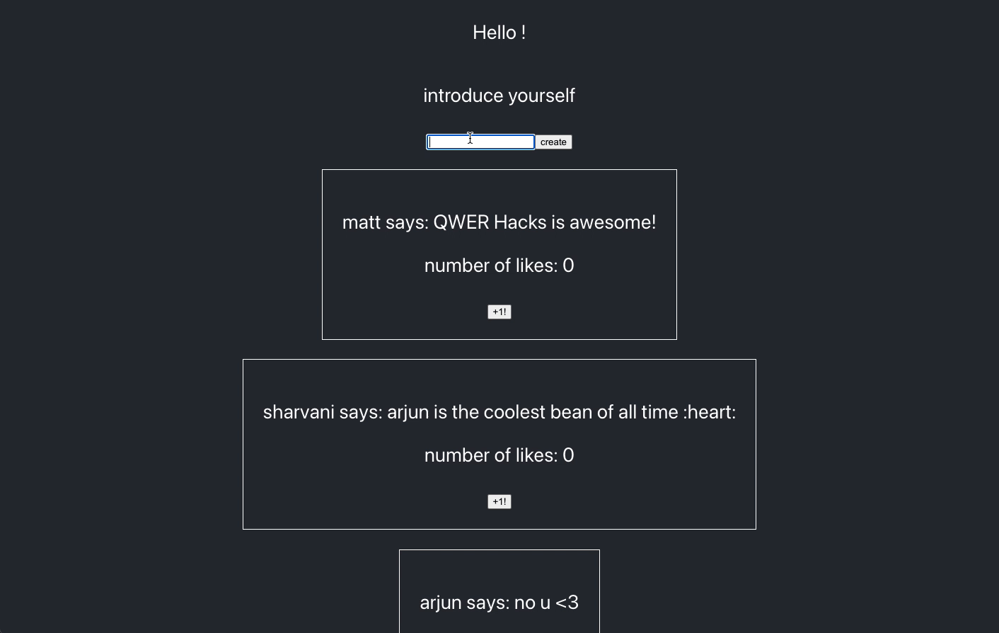

And that's it! Our Twitter clone is far from perfect, but we've made it our own! And, along the way, we've learned quite a bit about React! As your app becomes more and more complex, abstractions like components, props, and state can help you write clean, bug-free code. And, as we've shown, complex UI problems can be broken down into very simple questions: how do we render data from a list? How do we get user input from a form? How do we show something on a boolean condition?

A quick recap, we covered:

* the JavaScript ternary operator, `?`
* conditionally rendering with `?`
* conditionally rendering with `&&`

**Checkpoint 5:** [check out the code](./05-checkpoint). This is the final checkpoint! You can also view a full project codebase [here](https://github.com/malsf21/qwerhacks-21-workshops/tree/main/firebase/with-react/starter-code).

*Aside*: there's actually a different way that we could approach this, which is to refactor `ComposeTweet` into a generic `TextInput`-type component, and reuse the same component for the author name and tweet composition tasks. In fact, given our current project, this is likely what I would've done! But, if things got more complicated (e.g. you can add images to Tweets), then this approach wouldn't work as well.

## Using GitHub and Netlify to Deploy Your App For Free

Note: this section *does not* rely on any previous section, but it makes the most sense to do it after you're done everything else :)

Okay, so you've got a wonderful React app. How can we let everyone in the world see how awesome it is? Well, there are quite a few approaches, but we'll use a **continuous deployment** pipeline involving GitHub and Netlify. The advantages of this pipeline are:

1. it's free!
2. once you set it up, you don't have to do anything else!

Those both sound great to me! Let's get started.

Before we actually set anything up, we want to make sure our app "compiles". To check that, you can run:

```sh
$ npm run build
...
```

If this works, then you're all good to go!

### GitHub

If you haven't heard of GitHub before, it's a platform (on top of `git`) that makes it easy for developers to keep track of their code changes, collaborate on code, and manage projects! It's a very useful website for hackathons and software projects in general, and I'd definitely recommend learning more about it.

Today, we aren't going to be doing anything too complicated. First, let's make a new repository on GitHub. We already have some code, so don't add a `README` or a `.gitignore`:

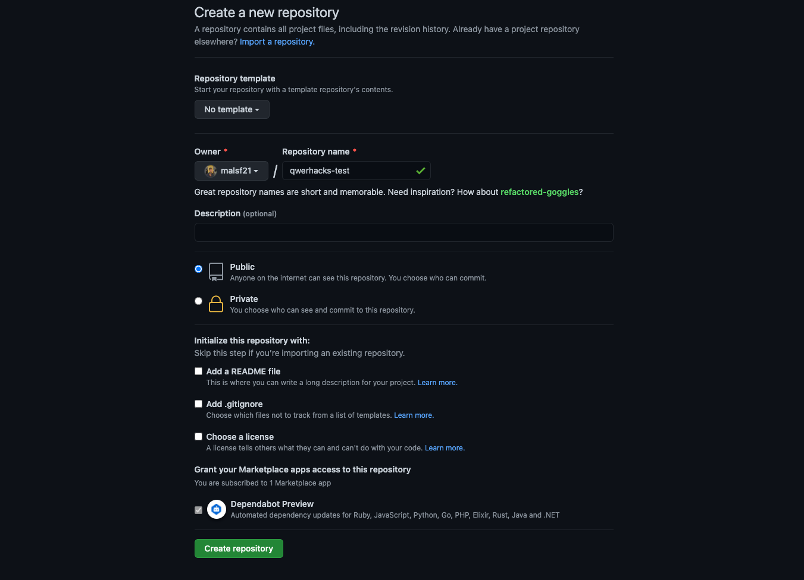

Now, we'll be on a page like this:

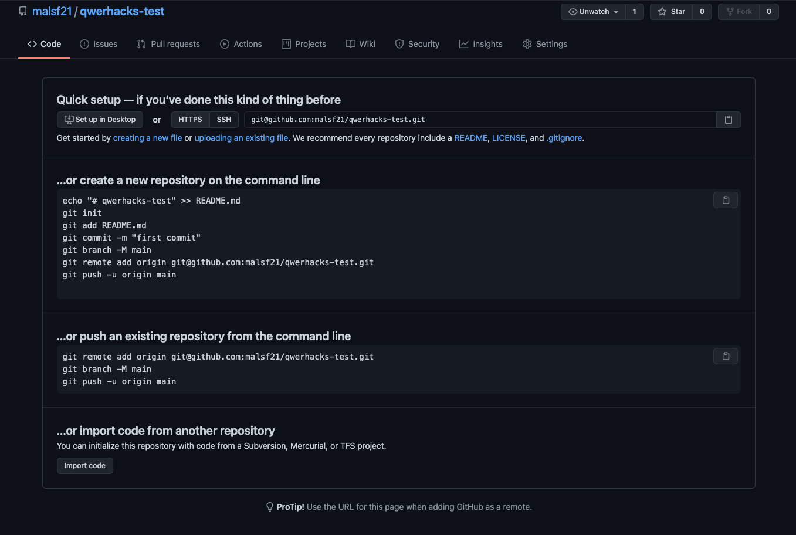

You may not know it, but we actually already have a repository set up! So, we're going to follow the instructions in "push an existing repository from the command line". Head to our `qwer-hacks` folder in the shell. First, if you've made any changes, do:

```sh
$ git add .
...
$ git commit -m "describe your changes here!"
...
```

Not sure what these do? Check out ACM-W's git workshop TODO!

Now, we'll set the remote for this repository, and push - just like GitHub told us:

```sh
git remote add origin git@github.com:malsf21/qwerhacks-test.git
git branch -M main
git push -u origin main
```

make sure to replace `git@github.com:malsf21/qwerhacks-test.git` with your repository information - it should be the first line of the "...or push an existing repository from the command line" section!

Awesome! If we head to GitHub, we'll see that our code is in the repository:


We're ready to move on to Netlify.

### Netlify

Back in my day, CD wasn't this easy! But Netlify makes things *super duper* convenient: after we set it up once, every time we push a new commit to GitHub, Netlify **automatically builds and deploys your site**. How convenient!

First, head to [Netlify's website](https://www.netlify.com/). You can log in with GitHub, which is probably the most convenient option.

Then, click "New site from Git"; select GitHub, then, find your repository and select it:

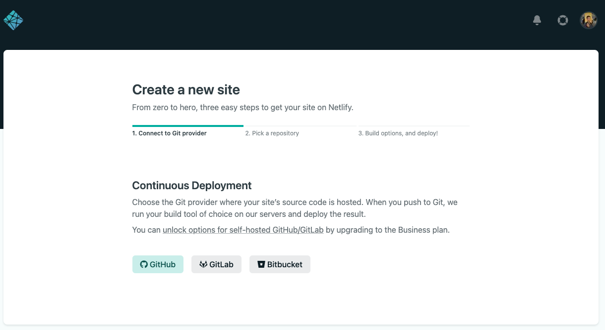

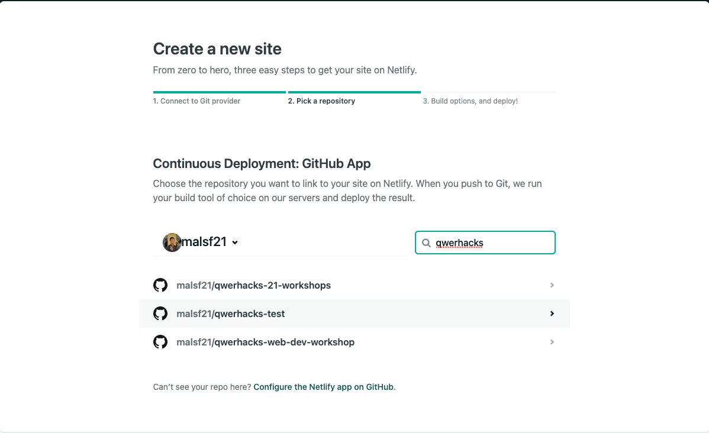

Netlify is pretty smart, so it already knows what to do; just hit "deploy site" on this page (your build command may be `npm run build` instead, that's fine too!)

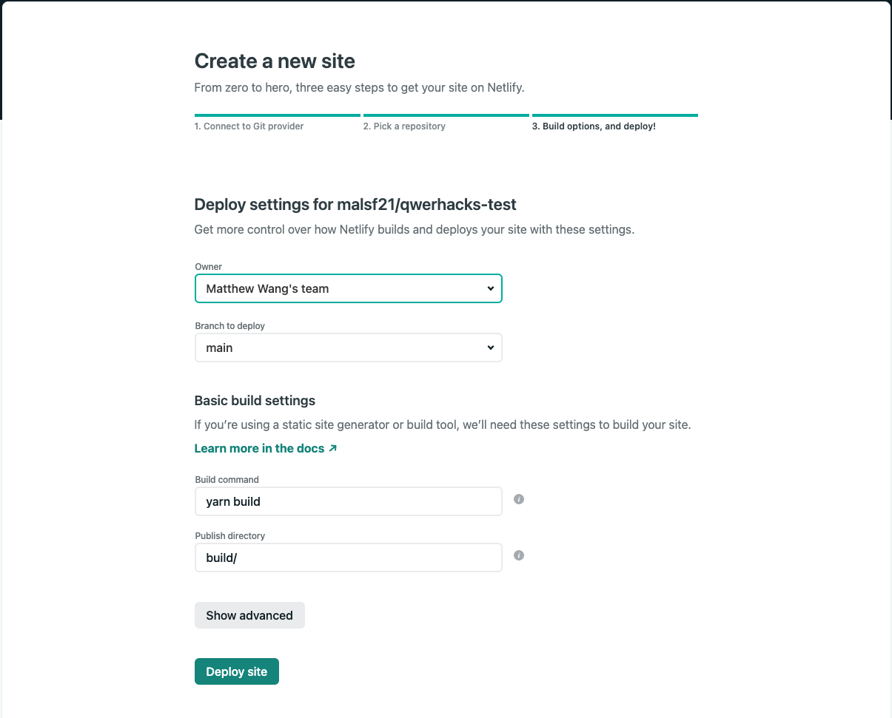

And ... that was it! Insane, right? Netlify will start building your project; once it's ready, you should be able to go to the URL it provided and see your app in action. It probably ends in `.netlify.app`, like in this screenshot:

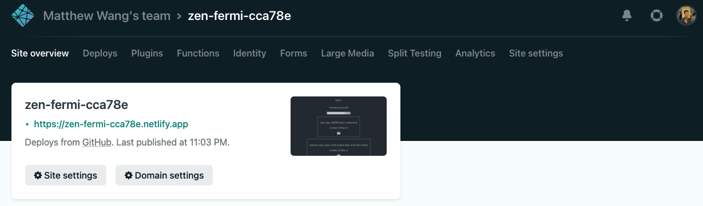

And that's it! Now, every time you make a change, all you need to do to deploy it is:

```sh
$ git add .
...
$ git commit -m "describe your changes here!"
...
$ git push
...
```

And GitHub + Netlify handles the rest!

Netlify has other cool features too, including [Deploy Previews](https://www.netlify.com/blog/2016/07/20/introducing-deploy-previews-in-netlify/) on pull requests, which is a great feature for collaborating with your team at a hackathon.

As a quick recap, we covered:

* creating a new repository on GitHub
* setting our local repository's remote (to the GitHub repository)
* committing and pushing our changes
* setting up Netlify to auto-deploy our changes

## Conclusion

Wow, that was a lot - but we did it! We covered **so much stuff**, including:

* setting up node
* using create-react-app to get a template
* understanding JSX as "HTML with superpowers"
* creating our own React components
* using `props` and state (`useState()`) to manage interactivity
* rendering lists of components with `.map()`
* controlling form inputs and listening to events
* conditional rendering with `?` and `&&`
* pushing our app to GitHub, and deploying it with Netlify

These fundamentals let you explore the whole wide world of React - and believe me, there's a lot! Here are a few places to continue from here:

* really dive deep with React [by looking at the official docs](https://reactjs.org/docs/getting-started.html)
* add routing to your app with [React Router](https://reactrouter.com/)
* create simple graphs and visualizations with [react-plotly](https://plotly.com/javascript/react/)
* implement beautiful animations with [react-anime](https://alain.xyz/libraries/react-anime)
* integrate it with Firestore - we have a [follow-up workshop on this](https://github.com/malsf21/qwerhacks-21-workshops/tree/main/firebase/with-react) :)

The world of React can be scary, and we're here to help! Many of our mentors have React experience (including me), so feel free to reach out to us during the hackathon if you've got questions! On top of that, you're always free to contact me if you've got any questions about this workshop.

Good luck hacking! Y'all got this <3

## Licensing, Attribution, and Resources

[Matt](https://matthewwang.me) has taught some variant of this workshop (among other React-related ones) several times before; past iterations include:

* [QWER Hacks 2020's Intro to Web Dev with React and Firebase](https://github.com/malsf21/qwerhacks-web-dev-workshop)
* [Learning Lab Crash Course: Intro to React](https://github.com/uclaacm/learning-lab-crash-course-su20/tree/master/07-intro-react)
* [Learning Lab Crash Course: Intermediate React](https://github.com/uclaacm/learning-lab-crash-course-su20/tree/master/09-intermediate-react-1)
* [Learning Lab Crash Course: React Hooks](https://github.com/uclaacm/learning-lab-crash-course-su20/tree/master/11-react-hooks)
* [Learning Lab Crash Course: Misc DevOps](https://github.com/uclaacm/learning-lab-crash-course-su20/tree/master/14-misc-devops)

He's also got a few favourite external sources, including:

* the [React official documentation](https://reactjs.org/docs/getting-started.html) and [official tutorial](https://reactjs.org/tutorial/tutorial.html)
* Tania Rascia's [React tutorial](https://www.taniarascia.com/getting-started-with-react/)
* ACM Hack's [Hackschool session on React](https://github.com/uclaacm/hackschool-f20/tree/main/session-7-intro-react)

The contents of this workshop (like the rest of this repository) are dual-licensed under the [MIT License](https://github.com/malsf21/qwerhacks-21-workshops/blob/main/LICENSE) and the [Creative Commons Attribution 4.0 License](https://creativecommons.org/licenses/by/4.0/); feel free to use whichever license suits your purpose better.

I'd love to hear if you found this helpful, or if you have any suggestions! Please send me an email at [matt@matthewwang.me](mailto:matt@matthewwang.me).
